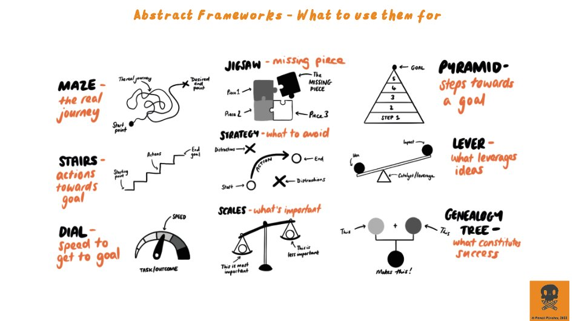
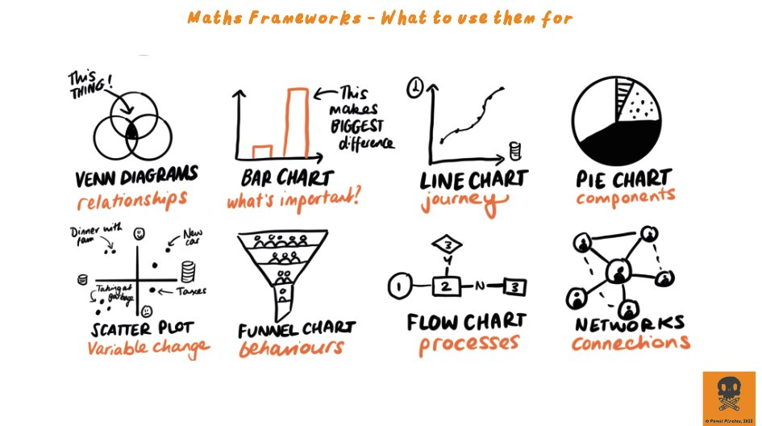
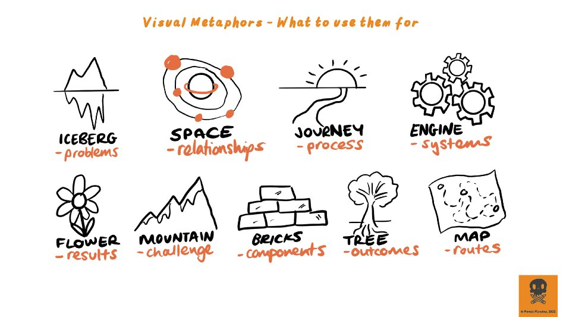
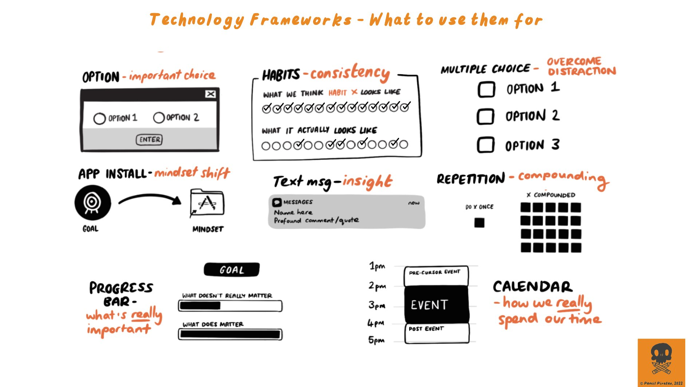

Atomic Visuals: simple, quick images

- Less than 5 minutes to make
- Less than 1 second to process

Visual thinking is about communication.

## Advantages - Why

- Drawing uses a different part of the brain. More connections, better creativity
- Better comprehension for images for consumers. People understand the content much faster.
- Better retention for images for consumers. 
- You'll remember the idea better if you create the image yourself

## How

- Develop a visual language 
- Develop a visual vocabulary 
- Use metaphors

When drawing an idea, use the image that comes from your "gut". When you have to show the idea love, use the heart shape. Many ideas can be easily communicated because we share a common visual language - that we might not be aware of.

### Covert a essay to images

- Find the most important sentences - max 3
- Find one word for each sentence
- Find an image that represents that idea
	- For inspiration, just search the word in google / for icons 

### Pre-existing vocabulary that you can adapt...

[Source](https://twitter.com/EvansNifty/status/1507269313186578432)

### Resources

- [Free Visual and Communication Resources](https://padlet.com/evansemporiumstore/lks3aoyyhkpnkmpe)
- [Course](https://www.pencil-pirates.com/)
- [Examples of Work](https://twitter.com/EvansNifty/status/1526984259575205888)