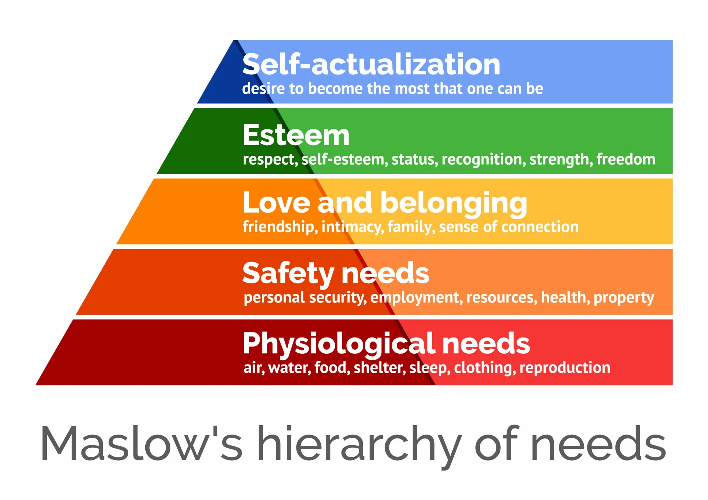

This model shows human needs as a 5 level pyramid. You only go to an upper level if the lower levels are satisfied.

- Self-Actualization
- Esteem
- Love/Belonging
- Safety
- Physiological(Food, water)

Related: [[ERG Theory]]